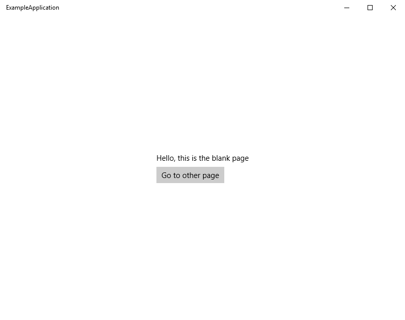
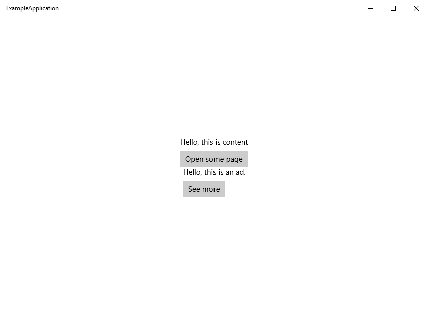

## PageFragments.UWP
Library, which adds easy page fragments, just like YouTube homepage.
## Getting started
Clone repository and run ExampleApplication or create your own: 
- Go to `App.xaml`
- Add xml namespace:
```xml
    xmlns:mvvmlight="using:GalaSoft.MvvmLight.Extensions.Xaml"
```
- Create a `ResourceDictionary`
- Define a mapping between view models and views (no `DataTemplate` and `DataType` needed):
```xml
<ResourceDictionary>
    <mvvmlight:ViewModelConverterPipe x:Key="viewModelConverter">
        <mvvmlight:Pair View="BlankPage" ViewModel="BlankPageViewModel"/>
        <mvvmlight:Pair View="OtherPage" ViewModel="OtherPageViewModel"/>
        <mvvmlight:Pair View="FirstPart" ViewModel="FirstPartViewModel"/>
        <mvvmlight:Pair View="SecondPart" ViewModel="SecondPartViewModel"/>
        <mvvmlight:Pair View="SeeMore" ViewModel="SeeMoreViewModel"/>
        <mvvmlight:Pair View="ErrorPage" ViewMode="ErrorViewModelWithNavigationCommands"/>
    </mvvmlight:ViewModelConverterPipe>
</ResourceDictionary>
```
- Go to MainPage.xaml
- Add `ContentControl`
```xaml
  <ContentControl Content="{Binding Children, 
                  Converter={StaticResource viewModelConverter}, 
                  ConverterParameter='main'}"
                  HorizontalAlignment="Center"
                  VerticalAlignment="Center"/>
```
- Create `BlankPage.xaml`:
```xml
<Page
    x:Class="ExampleApplication.BlankPage"
    xmlns="http://schemas.microsoft.com/winfx/2006/xaml/presentation"
    xmlns:x="http://schemas.microsoft.com/winfx/2006/xaml"
    xmlns:d="http://schemas.microsoft.com/expression/blend/2008"
    xmlns:mc="http://schemas.openxmlformats.org/markup-compatibility/2006"
    mc:Ignorable="d">

        <StackPanel Orientation="Vertical" 
                    HorizontalAlignment="Center" 
                    VerticalAlignment="Center">
            <TextBlock>Hello, this is the blank page</TextBlock>
            <Button Command="{Binding GoToOtherCommand}"
                    Margin="0 8 0 0">
                Go to other page
            </Button>
        </StackPanel>
</Page>
```
- Create BlankPageViewModel:
```csharp
public class BlankPageViewModel : RedirectViewModel
{
    public ICommand GoToOtherCommand => new NavigateToCommand(this, new OtherPageViewModel(this));
    
    public BlankPageViewModel(RedirectViewModel other) : base(other)
    {

    }

    public BlankPageViewModel(INavigationRoot root, string childName = "main") : base(root, childName)
    {

    }
}
```
- Create MainPageViewModel:
```csharp
public class MainPageViewModel : HostViewModel
{
    public MainPageViewModel()
    {
        NavigateTo("main", new BlankPageViewModel(this));
    }
}
```
- You will see an application is navigated to the `BlankPage`:

 ## What does "main" mean?
 "Main" is a name of a child, or part of an app screen space, so "main" stands for a main part of an app, unlike "ads" for example. Let's create an `OtherPageViewModel` with content part and ads part:
```csharp
public class OtherPageViewModel : RedirectViewModelWithContent
{
    public OtherPageViewModel(INavigationChild source) : base(source)
    {
        NavigateTo("ads", new SecondPartViewModel(this, "ads"));
        NavigateTo("content", new FirstPartViewModel(this, "content"));
    }
}
```
and `OtherPage`:
```xml
<Page
    x:Class="ExampleApplication.OtherPage"
    xmlns="http://schemas.microsoft.com/winfx/2006/xaml/presentation"
    xmlns:x="http://schemas.microsoft.com/winfx/2006/xaml"
    xmlns:d="http://schemas.microsoft.com/expression/blend/2008"
    xmlns:mc="http://schemas.openxmlformats.org/markup-compatibility/2006"
    mc:Ignorable="d">

    <Grid Background="{ThemeResource ApplicationPageBackgroundThemeBrush}">
        <Grid.RowDefinitions>
            <RowDefinition/>
            <RowDefinition/>
        </Grid.RowDefinitions>

        <ContentControl Grid.Row="0"
                        Content="{Binding Children, 
                        Converter={StaticResource viewModelConverter}, 
                        ConverterParameter='content'}"/>

        <ContentControl Grid.Row="1"
                        Content="{Binding Children, 
                        Converter={StaticResource viewModelConverter}, 
                        ConverterParameter='ads'}"/>
    </Grid>
</Page>
```
You will see an application is navigated to both `FirstPart` and `SecondPart`:

## Showing crash reports
- Go to `App.xaml.cs`
- Paste this code (you may change it)
```csharp
public App()
{
    this.InitializeComponent();
    this.Suspending += OnSuspending;
    this.UnhandledException += (sender, e) =>
    {
        //this is "our" MainViewModel
        INavigationRoot navigationRoot = Window.Current.Content
            .As<Frame>().Content
            .As<FrameworkElement>().DataContext
            .As<INavigationRoot>();

            navigationRoot.NavigateTo(
               "main",
               new ErrorViewModelWithNavigationCommands(navigationRoot, e.Exception)
            );
    };
}
```
To be continued...
